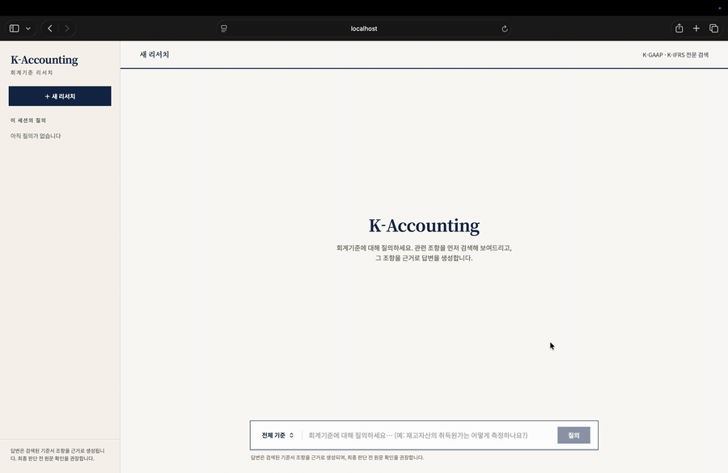
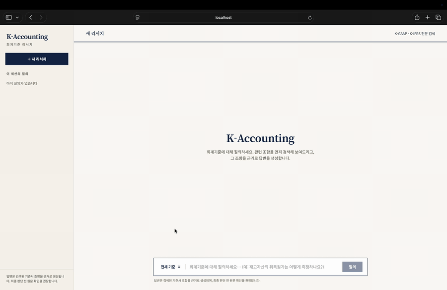
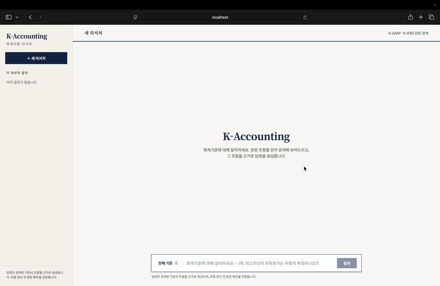

# 회계 기준서 RAG(Retrieval-Augmented Generation) 시스템

> 본 회계 기준서 RAG 시스템 프로젝트는 **K-GAAP(한국 일반기업회계기준) 중심**으로 하여 회계 기준서 원문을 검색하고, 관련 조항과 인용을 함께 제시하는 질의응답 서비스입니다.


사용자는 자연어로 회계처리, 인식 시점, 측정, 공시 등을 질문할 수 있고, 시스템은 근거 조항을 검색한 뒤 LLM(Large Language Model)이 근거 범위 안에서 답변을 생성합니다.

현재 프로젝트 버전에서는 K-GAAP 조항에 근거한 회계처리만을 주요 사용 사례로 두고, K-IFRS(한국채택국제회계기준)기반 회계처리는 차후 업데이트 예정입니다.

> 본 프로젝트는 비영리·공익 목적으로 개발되었으며, 상업적 용도로 사용할 수 없습니다.  
> 또한, 데이터셋을 제공하지 않아 관련해서 가이드라인 문서를 참고해서 문서 파싱 및 온톨로지는 사용자가 직접 구성해야합니다.

## 🎬 데모

아래는 실제 화면 녹화입니다. 세 가지 상황 — 기본 질의, 사람 확인, 근거가 없을 때의 처리 — 을 보여줍니다.

**① 기본 질의** — 질의를 입력하면 관련 기준서 조항을 먼저 찾아 보여주고, 그 조항을 근거로 답변과 인용을 제시합니다.



**② 사람 확인(HIL)** — 질의가 여러 주제로 쪼개질 만큼 복잡하면, 검색에 들어가기 전에 재작성 전략을 사람이 직접 확인하고 승인합니다.



**③ 정직한 거절** — 기준서에서 충분한 근거를 찾지 못하면, 답을 지어내지 않고 확정적으로 답할 수 없음을 알립니다.



<!--
고화질 MP4: GitHub 웹 편집기(또는 이슈 코멘트)에 docs/assets/demo-*.mp4 를 드래그 업로드하면
발급되는 첨부 URL로 아래처럼 넣을 수 있습니다.
<video src="https://github.com/user-attachments/assets/…" controls width="720"></video>
-->

## 🚀 주요 기능

- **워크플로**: LangGraph 기반으로 `질문 재작성(rewrite) → 검색(search) → 리랭킹(rerank, 기본 비활성) → 품질 평가(evaluate) → 답변 생성(generate)`의 메인 경로 5단계 파이프라인
- **하이브리드 검색**: Dense Search와 Sparse Search를 함께 실행하고, RRF(Reciprocal Rank Fusion)로 결과를 병합합니다.
- **근거 품질 평가**: CRAG(Corrective Retrieval-Augmented Generation) 방식의 평가 단계를 통해 근거가 부족하면 제한된 횟수 안에서 재검색을 시도합니다.
- **선택적 사용자 확인**: HIL(Human-in-the-Loop) 분기를 통해 질의를 쪼개거나 상위 개념으로 바꾸는 재작성 전략이 필요할 때 사용자 확인을 받을 수 있습니다.
- **일관된 응답 계약**: CLI, API, MCP(Model Context Protocol), Codex Skill이 같은 워크플로와 답변·조항·인용 구조를 사용합니다.
- **웹 화면 제공**: FastAPI와 React 정적 파일을 하나의 앱 컨테이너에서 제공하며, 원문 PDF(Portable Document Format) 조회 엔드포인트도 함께 제공합니다.

## 시스템 아키텍처
<!-- Mermaid 기반으로 정리 -->

## 성능 지표
<!-- 실제 답변 비교 및 RAGAS에 대한 평가 지표 제공. -->

## 활용법
<!-- 사용자 UI 및 기본 질문에 대한 화면 필요-->

## 🛠️ 빠른 시작

기본 구성은 PostgreSQL + pgvector 데이터베이스, TEI(Text Embeddings Inference) 임베딩 서버, FastAPI + React 앱 서버로 나뉩니다. 임베딩 모델은 `nlpai-lab/KURE-v1`이며, 리랭커는 기본적으로 비활성 처리.

```bash
cp .env.example .env   # 최초 1회, OPENAI_API_KEY 등 입력
./install.sh           # Docker(database·embedding·app) 빌드 및 기동
```

브라우저 진입점은 `http://localhost:8000`이고, API 문서는 `http://localhost:8000/docs`입니다.

## 📦 설치

호스트에서 직접 실행하거나 개발하려면 uv로 Python 의존성을 설치합니다.

```bash
uv sync
```

기본 설치는 Docker의 TEI 임베딩 서버를 사용합니다. 문서 파싱 적재나 로컬 임베딩 모델 로드가 필요할 때만 extra를 추가합니다.

```bash
uv sync --extra ingest           # PDF 파싱과 온톨로지 빌드 경로
uv sync --extra local-embedding  # EMBEDDING_SERVER_URL 없이 로컬 KURE-v1 직접 로드
uv sync --extra reranker         # 선택적 Cross-Encoder 리랭커 실험
```

데이터베이스만 따로 기동하려면 다음 명령을 사용합니다.

```bash
docker compose up -d database
```

## ▶️ 실행

### 문서 적재
<!-- 문서 다운로드 관련 내용 정리 해서 추가 -->
진입점 `src/main.py`의 `ingest` 서브커맨드는 온톨로지 JSON 또는 단일 PDF/Markdown 문서를 청킹하고 임베딩한 뒤 pgvector의 `chunks` 테이블에 저장합니다.

```bash
# data/ontology 전체 장을 적재
uv run python -m src.main ingest

# 기존 컬렉션을 비우고 새로 적재
uv run python -m src.main ingest --reset

# 단일 PDF에서 파싱 → 온톨로지 빌드 → 청킹·적재까지 실행
uv run python -m src.main ingest --pdf data/raw_data/제6장.pdf --standard-id gaap-ch6 --standard-type GAAP
```

원본 회계기준 PDF는 저작권 문제로 저장소에 포함하지 않습니다. `data/raw_data/README.md` BYO(Bring Your Own) 방식을 따릅니다.

### 질의

적재된 데이터를 기반으로 `rewrite → search → rerank → evaluate → generate` 워크플로를 실행합니다.

```bash
uv run python -m src.main query "금융자산의 최초 인식 시점은?"
uv run python -m src.main query "리스 회계처리" --standard GAAP
```

컨테이너 안에서 실행하려면 다음처럼 호출합니다.

```bash
docker compose exec app uv run python -m src.main query "금융자산의 최초 인식 시점은?"
```

### 웹 화면

Docker Compose는 API와 React 화면을 함께 서빙하는 앱 컨테이너를 실행합니다.

```bash
docker compose up -d --build
open http://localhost:8000
```

프론트엔드 개발 서버를 별도로 띄울 때만 Vite를 사용합니다. 이 경우 `frontend/vite.config.ts`가 `/query`, `/resume`, `/documents` 요청을 `localhost:8000`으로 프록시합니다.

```bash
uv run uvicorn src.api.server:app --host 0.0.0.0 --port 8000
cd frontend
npm install
npm run dev
```

기존 Streamlit 화면인 `app.py`는 React 화면이 동일 기능을 대체하면서 유지보수 동결(deprecated) 상태입니다. 신규 기능은 React 경로에 추가합니다.

## 🔌 MCP 서버

FastMCP 기반 MCP 서버는 RAG 질의를 도구로 노출합니다. 도구는 `query_standards`와 `resume_query` 두 가지이며, 응답 스키마는 HTTP API의 `/query`, `/resume`과 동일합니다.

```bash
claude mcp add accounting-rag -- uv run python -m src.mcp_server.server
```

MCP 서버를 사용하려면 데이터베이스와 임베딩 서버가 떠 있어야 합니다.

```bash
docker compose up -d database embedding
```

TEI 임베딩 서버를 쓰려면 환경변수 `EMBEDDING_SERVER_URL=http://localhost:8080`을 설정합니다.

## 🧩 Codex 플러그인

Codex 플러그인은 회계 기준 질의가 들어왔을 때 `k-accounting` Skill을 통해 MCP 도구 호출을 유도합니다. 이 저장소 전체가 Codex 마켓플레이스이고, `src/`가 플러그인 루트입니다.

```bash
codex plugin marketplace add .
codex plugin add k-accounting@k-accounting-marketplace
```

플러그인 설치 후에는 Codex 세션을 이 저장소 루트에서 열어야 합니다. MCP 서버는 플러그인에 번들되어 있으므로 Claude처럼 별도 `mcp add`를 실행할 필요는 없습니다. 단, 데이터베이스와 임베딩 서버는 별도로 실행되어 있어야 합니다.


## 🔍 LangSmith 트레이싱

LangSmith 트레이싱을 통해 파이프라인 노드 흐름, 입출력, 지연 시간을 추적가능하며, `.env`에 다음 값을 넣어서 활성화할 수 있습니다.

```bash
LANGCHAIN_TRACING_V2=true
LANGCHAIN_API_KEY=ls-your-key-here
LANGCHAIN_PROJECT=your_project_name
```

## 📂 프로젝트 구조

```text
src/
  agent/          LangGraph 워크플로와 노드 구현
  api/            FastAPI 서버와 응답 스키마
  clients/        LLM 클라이언트와 임베딩 클라이언트
  db/             PostgreSQL/pgvector 연결과 벡터 저장소
  ingest/         PDF 파싱, 온톨로지 빌드, 청킹
  mcp_server/     MCP 도구 서버
  retrieval/      검색, RRF 병합, 선택적 리랭킹
  skills/         Codex/Claude Skill 정의
frontend/         React UI(User Interface)
docs/             아키텍처, 개발 가이드, 검색/온톨로지 문서
tests/            단위 테스트와 통합 테스트
scripts/          벤치마크와 재현 스크립트
data/             사용자 제공 원문과 테스트 데이터
```

## ✅ 테스트와 검증

단위 테스트와 통합 테스트는 pytest로 실행합니다.

```bash
uv run pytest tests/unit
uv run pytest tests/integration
```

벤치마크 재현은 다음 스크립트에서 시작합니다.

```bash
uv run python scripts/benchmark_baseline.py
```

평가 기준은 [docs/benchmark/eval_pass_rules.md](docs/benchmark/eval_pass_rules.md)를 따릅니다.

## 📚 데이터 출처

본 프로젝트에서 사용하는 회계기준 원문은 한국회계기준원이 공개한 자료를 사용자가 직접 내려받아 구성합니다.

> 출처: 한국회계기준원 http://www.kasb.or.kr Copyright ©KAI all rights reserved.

## 📄 라이선스

이 프로젝트는 MIT(Massachusetts Institute of Technology) 라이선스를 따릅니다.
