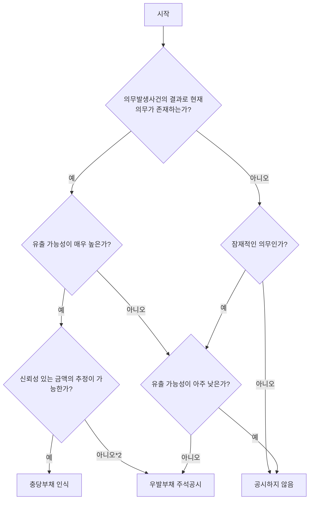

#### 실14.10 의사결정 순서도 및 충당부채와 우발부채의 인식요건

이 도식은 충당부채와 우발부채의 인식 요건을 판단하는 의사결정 순서를 나타낸다. 구성 요소는 의무의 존재 여부, 유출 가능성, 금액 추정 가능성에 따른 판단 단계로 구성되며, 각 단계는 '예' 또는 '아니오'에 따라 충당부채 인식, 우발부채 주석공시, 또는 공시하지 않음으로 이어진다.

| 자원유출가능성 | 금액추정가능성 | |
| :--- | :--- | :--- |
| | **신뢰성 있게 추정가능** | **추정불가** |
| 가능성이 매우 높음 | 충당부채로 인식 | 우발부채로 주석공시 |
| 가능성이 어느 정도 있음 | 우발부채로 주석공시 | 우발부채로 주석공시 |
| 가능성이 거의 없음 | 공시하지 않음$^{3)}$ | 공시하지 않음$^{3)}$ |

이 표는 자원유출가능성과 금액추정가능성에 따른 충당부채 및 우발부채의 인식 및 공시 여부를 요약한 것이다. 주요 내용은 유출 가능성이 매우 높고 금액을 신뢰성 있게 추정할 수 있는 경우 충당부채로 인식하며, 그 외의 경우 우발부채로 주석공시하거나 공시하지 않음을 나타낸다.

주1) 현재의무가 발생하였는지의 여부가 명확하지 않은 경우에도 모든 이용가능한 증거를 통하여 재무상태표일 현재 의무의 발생 가능성이 매우 높다고 판단되면 과거의 사건이나 거래의 결과로 현재의무가 발생한 것으로 본다.

주2) 아주 드물게 발생함.

주3) 자원의 유출 가능성이 거의 없더라도 타인에게 제공한 지급보증 또는 이와 유사한 보증, 중요한 계류 중인 소송사건은 그 내용을 주석으로 기재한다.

#### 실14.11
소송 중인 사건의 1심 판결 내용은 충당부채의 측정에 반영하여 인식한다. 1심 판결의 내용이 2심 판결에 의해 변경될 가능성이 매우 높고 이에 대한 추가적인 정보가 있는 경우에는 그러한 변경 가능성을 반영하여 충당부채를 인식한다. (문단14.7, 14.8)