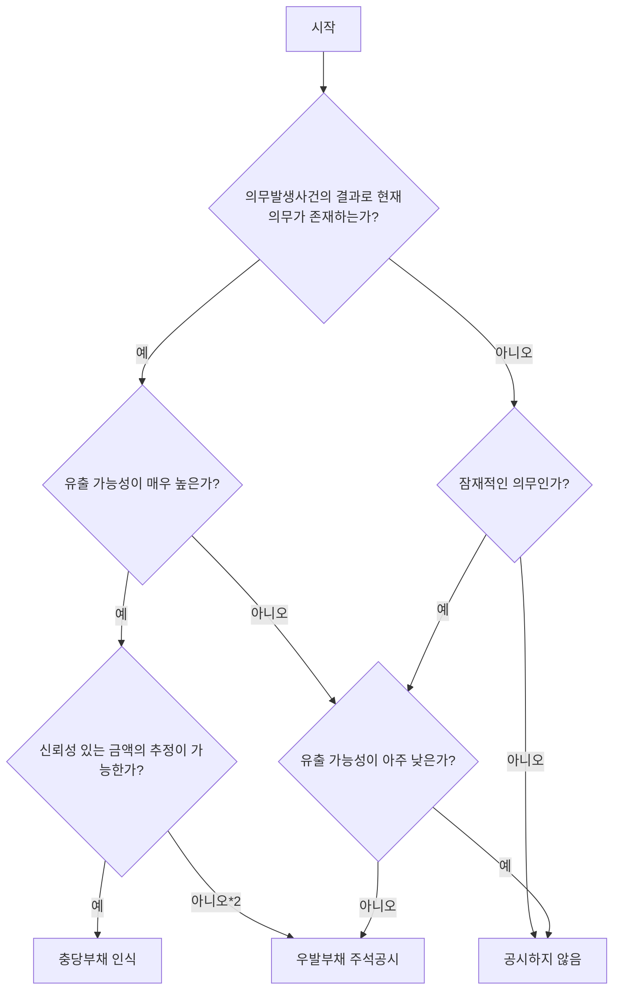

# 제14장_충당부채,_우발부채_및_우발자산(2018_연차개선_반영) — LLM parsed

<!-- page 1 -->

# 일반기업회계기준

**제14장 충당부채, 우발부채, 우발자산**

한국회계기준원 회계기준위원회

**의결 2018. 9. 21.**

<!-- page 2 -->

### 목적

#### 14.1
이 장의 목적은 충당부채, 우발부채, 우발자산의 회계처리와 공시에 필요한 사항을 정하는 데 있다.

### 적용범위

#### 14.2
이 장의 적용대상이 되는 거래나 사건의 예는 다음과 같다.

##### (1)
판매 후 품질 등을 보증하는 경우의 관련 부채

##### (2)
판매촉진을 위하여 시행하는 환불정책, 경품, 포인트적립·마일리지 제도의 시행 등과 관련된 부채

##### (3)
손실부담계약

##### (4)
타인의 채무 등에 대한 보증

##### (5)
계류중인 소송사건

##### (6)
구조조정계획과 관련된 부채

##### (7)
복구충당부채 등의 환경관련부채

다음의 경우에는 이 장을 적용하지 아니한다.

##### (1)
모든 당사자가 계약상의 의무를 전혀 이행하지 아니하거나 동일한 비율로 의무의 일부만을 이행한 미이행계약. 다만, 손실부담계약의 경우는 이 장을 적용한다.

##### (2)
별도의 장에서 정하고 있는 금융상품(파생상품을 포함한다), 건설형공사계약, 법인세, 중업원급여, 리스거래(다만, 손실부담계약의 경우는 이 장을 적용한다), 배출부채 또는 이 장의 적용을 배제하기로 정한 거래나 사건

<!-- page 3 -->

### 인식

### 충당부채

#### 14.3
충당부채는 과거사건이나 거래의 결과에 의한 현재의무로서, 지출의 시기 또는 금액이 불확실하지만 그 의무를 이행하기 위하여 자원이 유출될 가능성이 매우 높고 또한 당해 금액을 신뢰성 있게 추정할 수 있는 의무를 말한다.

#### 14.4
충당부채는 다음의 요건을 모두 충족하는 경우에 인식한다.

##### (1)
과거사건이나 거래의 결과로 현재의무가 존재한다.

##### (2)
당해 의무를 이행하기 위하여 자원이 유출될 가능성이 매우 높다.

##### (3)
그 의무의 이행에 소요되는 금액을 신뢰성 있게 추정할 수 있다.

### 우발부채

#### 14.5
우발부채는 부채로 인식하지 아니한다. 의무를 이행하기 위하여 자원이 유출될 가능성이 아주 낮지 않는 한, 우발부채를 주석에 기재한다.

### 우발자산

#### 14.6
우발자산은 자산으로 인식하지 아니하고 자원의 유입가능성이 매우 높은 경우에만 주석에 기재한다. 상황변화로 인하여 자원이 유입될 것이 확정된 경우에는 그러한 상황변화가 발생한 기간에 관련된 자산과 이익을 인식한다.

### 측정

<!-- page 4 -->

#### 14.7
충당부채로 인식하는 금액은 현재의무의 이행에 소요되는 지출에 대한 보고기간말 현재 최선의 추정치이어야 한다.

#### 14.8
충당부채의 금액에 대한 최선의 추정치는 관련된 사건과 상황에 대한 불확실성이 고려되어야 한다.

#### 14.9
충당부채의 명목금액과 현재가치의 차이가 중요한 경우에는 의무를 이행하기 위하여 예상되는 지출액의 현재가치로 평가한다.

#### 14.10
현재가치 평가에 사용하는 할인율은 그 부채의 고유한 위험과 화폐의 시간가치에 대한 현행 시장의 평가를 반영한 세전 이율이다. 이 경우, 만기까지의 기간이 유사한 국공채이자율에 기업의 신용위험을 반영한 조정 금리를 가산하여 산출한 이자율을 할인율로 사용할 수 있다. 이 할인율에 반영되는 위험에는 미래 현금흐름을 추정할 때 고려된 현금흐름 자체의 변동위험은 포함되지 아니한다.

#### 14.11
현재의무를 이행하기 위하여 소요되는 지출 금액에 영향을 미치는 미래사건이 발생할 것이라는 충분하고 객관적인 증거가 있는 경우에는 그러한 미래사건을 감안하여 충당부채 금액을 추정한다.

#### 14.12
충당부채를 발생시킨 사건과 밀접하게 관련된 자산의 처분차익이 예상되는 경우에 당해 처분차익은 충당부채 금액을 측정하면서 고려하지 아니한다.

### 충당부채의 변제

#### 14.13
대부분의 경우 기업은 전체 의무 금액에 대하여 책임이 있으므로 제3자가 변제할 수 없게 되면 기업은 그 전체금액을 이행할 책임

<!-- page 5 -->

을 진다. 이 경우 기업은 의무금액을 부채로 인식하고, 제3자가 변제할 것이 확실한 경우에 한하여 그 금액을 자산으로 인식한다. 다만, 자산으로 인식하는 금액은 관련 충당부채 금액을 초과할 수 없다. 이 경우 제3자의 변제에 따른 수익에 해당하는 금액은 충당부채의 인식에 따라 손익계산서에 계상될 관련 비용과 상계한다.

### 충당부채의 변동

#### 14.14
충당부채는 보고기간말마다 그 잔액을 검토하고, 보고기간말 현재 최선의 추정치를 반영하여 증감조정한다. 이 경우 당해 충당부채의 현재가치 평가에 사용한 할인율은 변동되지 않는 것으로 보고 당초에 사용한 할인율이나 매 보고기간말 현재 최선의 추정치를 반영한 할인율 중 한 가지를 선택하여 계속 적용하도록 한다. 충당부채를 현재가치로 평가하여 표시하는 경우에는 장부금액을 기간 경과에 따라 증가시키고 해당 증가 금액은 당기비용으로 인식한다. 상황변동으로 인하여 더 이상 충당부채의 인식요건을 충족하지 아니하게 되면, 관련 충당부채는 환입하여 당기손익에 반영한다.

### 충당부채의 사용

#### 14.15
충당부채는 최초의 인식시점에서 의도한 목적과 용도에만 사용하여야 한다. 다른 목적으로 충당부채를 사용하면 상이한 목적을 가진 두 가지 지출의 영향이 적절하게 표시되지 못하기 때문이다.

### 인식과 측정의 특수한 상황

#### 14.16
손실부담계약을 체결한 경우에는 관련된 현재의무를 충당부채로 인식한다.

<!-- page 6 -->

#### 14.17
구조조정에 대한 의제의무는 다음의 요건을 모두 충족하는 경우에 발생된다.
(1) 구조조정에 대한 공식적이며 구체적인 계획에 의하여 적어도 아래에 열거하는 내용을 모두 확인할 수 있어야 한다.
###### (가) 구조조정 대상이 되는 사업
###### (나) 구조조정의 영향을 받는 주사업장 소재지
###### (다) 구조조정에 소요되는 지출 내용
###### (라) 구조조정계획의 이행시기
(2) 기업이 구조조정 계획의 이행에 착수하였거나 구조조정의 주요 내용을 공표함으로써 구조조정의 영향을 받을 당사자가 기업이 구조조정을 이행할 것이라는 정당한 기대를 가져야 한다.

#### 14.18
구조조정충당부채로 인식할 수 있는 지출은 구조조정과 관련하여 직접 발생하여야 하고 다음의 요건을 모두 충족하여야 한다.
(1) 구조조정과 관련하여 필수적으로 발생하는 지출
(2) 기업의 지속적인 활동과 관련 없는 지출

### 주석공시

#### 14.19
충당부채는 유형별로 다음의 내용을 주석에 기재한다.
(1) 기초와 기말 장부금액 및 당기 증감 내용
당기 증감 내용에는 현재가치로 평가한 충당부채의 기간 경과에 따른 당기 증가 금액, 환입금액 및 사용금액을 포함한다. 전기재무제표상의 증감 내용은 비교표시하지 아니할 수 있다.
(2) 충당부채의 성격과 자원의 유출이 예상되는 시기
(3) 유출될 자원의 금액과 시기에 대한 불확실성 정도(필요한 경우, 관련된 미래사건에 대한 중요한 가정 포함)
(4) 제3자에 의한 변제 기대금액 및 그와 관련하여 인식한 자산 금액

<!-- page 7 -->

##### (5) 현재가치로 평가한 충당부채의 기간 경과에 따른 당기 증가금액 및 할인율 변동에 따른 효과

#### 14.20
의무를 이행하기 위하여 자원이 유출될 가능성이 아주 낮지 않은 한, 우발부채는 유형별로 그 성격을 주석에 설명하고 가능하면 다음의 내용을 주석에 기재한다.
##### (1) 우발부채의 추정금액
##### (2) 자원의 유출 금액 및 시기와 관련된 불확실성 정도
##### (3) 제3자에 의한 변제의 가능성

#### 14.21
의무를 이행하기 위한 자원의 유출 가능성이 거의 없더라도 다음의 경우에는 그 내용을 주석으로 기재한다.
##### (1) 타인에게 제공한 지급보증 또는 이와 유사한 보증
##### (2) 중요한 계류중인 소송사건

#### 14.22
자원의 유입 가능성이 매우 높은 우발자산은 그 성격을 주석에 설명하고, 가능하면 우발자산의 추정금액도 포함하여 주석에 기재한다.

#### 14.23
우발부채와 우발자산에 대하여 주석으로 공시하여야 할 사항이지만 실무적인 이유로 공시하지 못한 경우에는 그 사유를 주석에 기재하여야 한다.

#### 14.24
매우 드물게 발생하는 경우이지만 충당부채, 우발부채, 우발자산과 관련하여 이 장에서 요구하는 모든 사항 또는 일부 사항을 주석에 기재하는 것이 진행 중인 상대방과의 분쟁에 현저하게 불리한 영향을 미칠 것으로 예상되는 경우에는 그에 관한 주석 공시를 생략할 수 있다. 다만, 그 분쟁의 개괄적인 성격과 주석 공시를 생략한 사실 등을 주석에 기재하여야 한다.

<!-- page 8 -->

## 용어의 정의

### 현재외무
보고기간말 현재 의무의 이행을 회피할 수 없는, 법적의무 또는 의제의무. '의무발생사건'은 이러한 현재외무를 발생시킨 과거사건

### 법적의무
명시적·묵시적 계약이나 법률 또는 법적효력에서 생기는 의무

### 의제의무
발표된 경영방침, 구체적이고 유효한 약속, 과거의 실무관행 등으로 기업이 특정 책임을 부담할 것이라고 표명함으로써 그 책임을 이행할 것이라는 정당한 기대를 상대방이 갖도록 하는 경우에 생기는 의무

### 우발부채
다음의 (1)이나 (2)에 해당하는 잠재적인 부채
##### (1) 과거사건은 생겼으나 기업이 전적으로 통제할 수 없는 하나 이상의 불확실한 미래 사건의 발생 여부로만 그 존재 유무를 확인할 수 있는 잠재적인 의무
##### (2) 과거사건으로 생긴 현재외무이지만 그 의무를 이행하기 위하여 자원을 유출할 가능성이 매우 높지 않거나, 또는 그 가능성은 매우 높으나 해당 의무의 이행에 필요한 금액을 신뢰성 있게 측정할 수 없는 경우

### 우발자산
과거사건으로 생겼으나, 기업이 전적으로 통제할 수 없는 하나 이상의 불확실한 미래 사건의 발생 여부로만 그 존재 유무를 확인할 수 있는 잠재적 자산이며, 우발자산은 미래에 확정되기까지 자산으로 인식할 수 없다.

### 손실부담계약
계약상 의무의 이행에 필요한 회피 불가능 원

<!-- page 9 -->

가가 그 계약에서 받을 것으로 예상되는 효익을 초과하는 계약. 회피 불가능한 원가는 계약을 이행하기 위한 최소원가로 다음의 (1)과 (2) 중 적은 금액
##### (1) 계약을 이행하기 위하여 필요한 원가
##### (2) 계약을 이행하지 못하였을 때 지급하여야 할 보상금이나 위약금

### 구조조정
경영자의 계획과 통제에 따라 사업의 범위나 사업수행방식을 중요하게 바꾸는 일련의 절차

<!-- page 10 -->

# 제14장 충당부채, 우발부채, 우발자산

### 결론도출근거

#### 결14.1
충당부채의 금액을 추정할 때에는 불확실성과 관련된 상황에 적합한 방법을 사용한다. 예를 들면, 현금유출이 발생할 경우가 여러 가지일 때 충당부채는 각 경우의 현금유출 추정액에 각각의 발생확률을 곱한 금액의 합계금액으로 인식할 수 있다. 이 경우, 현금유출 발생확률에 따라 충당부채로 인식하는 금액은 달라지게 된다. 만약 발생가능한 금액이 일정범위 내에서 비례적으로 증가하는 분포를 이루고 각각의 발생확률이 동일한 경우에는 그 범위의 중간값이 충당부채로 인식할 금액이다. 하나의 현재의무를 이행하기 위한 현금유출이 여러 가지 금액으로 추정될 수 있는 경우에는 그 중 발생확률이 가장 높은 추정금액(최빈치)으로 충당부채를 인식할 수 있다. 다만, 그 밖의 발생 가능한 추정금액 대부분이 발생확률이 가장 높은 추정금액 보다 더 큰(더 작은) 경우에는 발생확률이 가장 높은 추정금액 보다 더 큰(더 작은) 추정금액이 최선의 추정치가 될 수 있다. 인식할 금액이 범위로 추정될 경우 범위 내의 어떤 금액이 범위 내의 다른 금액 보다 더 나은 추정치라는 것은 가능한 추정금액의 범위 내에서 가장 가능성이 높은 금액을 의미한다. 다만, 그 밖의 추정금액이 최빈치를 기준으로 좌우의 어느 한쪽으로만 대부분 치우쳐 분포를 이루고 있는 경우에는 최빈치로 인식할 수 없으며 다른 추정치의 분포를 감안한 금액으로 충당부채 금액을 인식한다. 우발부채에 대해 주석에 기재하는 경우, 최선의 추정치를 결정할 수 없다면 발생가능한 금액의 일정범위를 기재할 수 있다. (문단 14.7, 14.8)

<!-- page 11 -->

### 실무지침

### 현재의무

#### 실14.1
과거사건이 현재의무를 발생시켰는지의 여부는 대부분의 경우 분명하다. 그러나 소송 사건과 같이 어떤 사건이 실제로 발생하였는지 혹은 그 사건으로 현재의무가 발생하였는지의 여부가 분명하지 아니한 경우가 있다. 이러한 경우에는 보고기간말 후에 발생한 사건이 제공하는 추가적인 증거를 포함한 이용 가능한 모든 증거를 고려하여 보고기간말 현재 의무가 존재하는지의 여부를 결정하여 다음과 같이 처리한다. (문단 14.3~14.5)

##### (1)
현재의무가 존재할 가능성이 매우 높고 인식기준을 충족하는 경우에는 충당부채로 인식한다.

##### (2)
현재의무가 존재할 가능성이 매우 높지만 인식기준을 충족하지 못하는 경우에는 우발부채로 주석에 기재한다.

##### (3)
현재의무가 존재할 가능성이 매우 높지가 않더라도 자원의 유출 가능성이 아주 낮지 않는 한, 우발부채로 주석에 기재한다.

### 과거사건

#### 실14.2
과거사건의 결과로 의무의 이행을 법적으로 강제할 수 있을 때 법적의무가 발생한다. 또한, 과거사건의 결과로 발표된 경영방침 등을 통하여 기업이 의무를 이행할 것이라는 정당한 기대를 상대방이 가지게 된 때 의제의무가 발생한다. 재무제표는 미래 시점의 예상 재무상태가 아니라 보고기간말 현재의 재무상태를 표시하는 것이므로, 과거사건과 관계없이 미래에 발생할 원가에 대하여는 충당부채를 인식하지 아니한다.(문단 14.3~14.5)

#### 실14.3
과거사건에 의하여 충당부채를 인식하기 위해서는 그 사건이 기업의 미래행위와 독립적이어야 한다. 예를 들면, 불법적인 환경오염으로 인한 범칙금이나 환경정화비용의 경우에는 기업의 미래행

<!-- page 12 -->

위에 관계없이 그 의무의 이행에 자원의 유출이 수반되므로 충당부채를 인식한다. 반면, 법에서 정하는 환경기준을 충족시키기 위해서 또는 상업적 압력 때문에 공장에 특정 정화장치를 설치하기 위한 비용지출을 계획하고 있는 경우에는 충당부채를 인식하지 아니한다. 공장운영방식을 바꾸어 그 지출을 회피할 수 있다면 그러한 지출은 현재의무가 아니다. (문단 14.3~14.5)

#### 실14.4
어떠한 사건은 발생 당시에는 현재의무를 발생시키지 아니하나 추후에 의무를 발생시킬 수 있다. 법규가 제·개정됨으로써 의무가 발생하거나 기업이 대외적으로 공표하는 행위에 의하여 추후에 의제의무가 발생하는 경우가 있기 때문이다. 예를 들면, 발생한 환경오염에 대하여 지금 당장 복구할 의무가 없는 경우에도 추후 새로운 법규가 그러한 환경오염을 복구하도록 강제하거나 기업이 그러한 복구의무를 의제의무로서 공식적으로 수용한다면, 당해 법규의 제·개정시점 또는 기업의 공식적인 수용시점에 그 환경오염은 의무발생사건이 된다. (문단 14.3~14.5)

#### 실14.5
입법 예고된 법규의 세부사항이 아직 확정되지 않은 경우에는 그 법규안대로 시행될 것이 확실한 때에만 법적의무가 발생한 것으로 본다. 법규 제·개정과 관련된 이해관계의 상충 등으로 인하여 법규의 시행을 확실하게 예측하기 어려운 경우에는 당해 법규가 시행되는 때에 법적의무가 발생한 것으로 본다. (문단 14.3~14.5)

### 자원의 유출가능성

#### 실14.6
충당부채로 인식하기 위해서는 현재의무가 존재하여야 할 뿐만 아니라 그 의무의 이행을 위한 자원의 유출 가능성이 매우 높아야 한다. (문단 14.4)

#### 실14.7
제품의 보증판매와 같이 다수의 유사한 의무가 있는 경우 그 의

<!-- page 13 : MISSING -->

<!-- page 14 -->

#### 실14.10 의사결정 순서도 및 충당부채와 우발부채의 인식요건

이 도식은 충당부채와 우발부채의 인식 요건을 판단하는 의사결정 순서를 나타낸다. 구성 요소는 의무의 존재 여부, 유출 가능성, 금액 추정 가능성에 따른 판단 단계로 구성되며, 각 단계는 '예' 또는 '아니오'에 따라 충당부채 인식, 우발부채 주석공시, 또는 공시하지 않음으로 이어진다.

| 자원유출가능성 | 금액추정가능성 | |
| :--- | :--- | :--- |
| | **신뢰성 있게 추정가능** | **추정불가** |
| 가능성이 매우 높음 | 충당부채로 인식 | 우발부채로 주석공시 |
| 가능성이 어느 정도 있음 | 우발부채로 주석공시 | 우발부채로 주석공시 |
| 가능성이 거의 없음 | 공시하지 않음$^{3)}$ | 공시하지 않음$^{3)}$ |

이 표는 자원유출가능성과 금액추정가능성에 따른 충당부채 및 우발부채의 인식 및 공시 여부를 요약한 것이다. 주요 내용은 유출 가능성이 매우 높고 금액을 신뢰성 있게 추정할 수 있는 경우 충당부채로 인식하며, 그 외의 경우 우발부채로 주석공시하거나 공시하지 않음을 나타낸다.

주1) 현재의무가 발생하였는지의 여부가 명확하지 않은 경우에도 모든 이용가능한 증거를 통하여 재무상태표일 현재 의무의 발생 가능성이 매우 높다고 판단되면 과거의 사건이나 거래의 결과로 현재의무가 발생한 것으로 본다.

주2) 아주 드물게 발생함.

주3) 자원의 유출 가능성이 거의 없더라도 타인에게 제공한 지급보증 또는 이와 유사한 보증, 중요한 계류 중인 소송사건은 그 내용을 주석으로 기재한다.

#### 실14.11
소송 중인 사건의 1심 판결 내용은 충당부채의 측정에 반영하여 인식한다. 1심 판결의 내용이 2심 판결에 의해 변경될 가능성이 매우 높고 이에 대한 추가적인 정보가 있는 경우에는 그러한 변경 가능성을 반영하여 충당부채를 인식한다. (문단14.7, 14.8)

<!-- page 15 -->

#### 실14.12
의제의무의 정의 중 '거래상대방의 정당한 기대'에 대한 판단기준: 법적의무는 없으나 발표된 경영방침 또는 구체적이고 유효한 약속이나 과거의 실무관행 등을 통하여 기업이 특정 책임을 부담한다는 것을 표명한 사실이 있으며, 기업이 이를 이행할 것이라고 거래상대방이 기대를 가지게 된 경우 의제의무가 발생한다. 다만, 다음의 경우에는 거래상대방의 정당한 기대를 인정하기 어렵다.
(1) 기업이 의무를 이행하지 않을 수도 있음을 사전에 충분히 공지하여 의무를 이행하지 않더라도 거래상대방과의 관계에 중대한 영향을 미치지 않는 경우
(2) 기업의 자유재량에 따라 의무를 이행하지 않더라도 거래상대방과의 관계에서 심각한 손해나 패널티가 발생하지 않는 경우
(3) 발표된 경영방침이나 구체적이고 유효한 약속을 통해 책임부담을 표명했음에도 불구하고 기업의 영업정책에 따라 의무이행 자체를 수시로 철회한 적이 있고 이러한 사실이 충분히 인지된 경우
(4) 정상적인 방법으로 의무이행을 대체할 수 있는 경우. (문단 14.3~14.5)

#### 실14.13
전체 매출액의 10%를 마일리지로 적립하고 매 10회의 매출이 발생한 후 11회의 매출시점에 누적마일리지를 사용하는 제도를 시행하는 경우 기업이 인식할 충당부채는 미래에 유출될 직접증분원가를 기준으로 인식하여야 하는 것이 타당하며, 마일리지를 사용할 경우 매출로 인식하지 않는 것이 타당하다. (문단 14.7, 14.8)

<!-- page 16 -->

### 적용사례

이 장의 제시된 사례의 회계처리를 통하여 그 밖의 상황에 대하여 회계처리가 가능하므로, 적용사례에서 '충당부채, 우발부채, 우발자산'에 관한 기업의 모든 회계처리를 다루지는 아니하였다. 예를 들어, 오염토지복구, 해저석유채굴, 단일보증, 대수선, 법적의무 있는 대수선, 재산손실, 품질보증 등을 다루지 아니하였다.

#### 사례1

(주)민국은 제품 구입 후 12개월 이내에 발생하는 제조상의 결함이나 다른 명백한 결함에 따른 하자에 대하여 제품보증을 실시하고 있다. 만약 20X0년도에 판매된 제품에서 중요하지 않은 결함이 발견된다면 12억원의 수리비용이 발생하게 되고, 치명적인 결함이 발생하게 되면 48억원의 수리비용이 발생하게 될 것으로 예상된다. 기업의 과거 경험과 미래 예측의 결과, 판매된 제품의 75%에는 하자가 없을 것으로 예상되며 제품의 20%는 중요하지 않은 결함이 발생할 것으로 예상되고 5%는 치명적인 결함이 있을 것으로 예상된다. 이와 같은 사례에서 최선의 추정치는 4.8억원(75%×0 + 20%×12억원 + 5%×48억원)으로 계산될 수 있다.

#### 사례2

하나의 현재의무를 이행하기 위한 현금유출이 여러 가지 금액으로 추정될 수 있는 경우에는 그 중 발생확률이 가장 높은 추정금액으로 충당부채를 인식할 수 있다. 다만, 그 밖의 발생 가능한 추정금액 대부분이 발생확률이 가장 높은 추정금액 보다 더 큰(더 작은) 경우에는 발생확률이 가장 높은 추정금액 보다 더 큰(더 작은) 추정금액이 최선의 추정치가 될 수 있다. 예를 들어, 어떤 기업이 수주한 공사를 완료한 이후에 하자보수를 한번(1,000,000원 소요)에 그칠 확률이 10%이고 2회(1,500,000원)에 걸쳐 하자보수할 확률이 20%, 3회(1,700,000원)가 50%, 4회 이상(2,000,000원)이 20%라면, 충당부채는 발생확률이 가장 높은 단일추정금액인 1,700,000원으로 설정할 수 있다. 그러나, 어떤 기업이 수주한 공사를 완료한 이후에 하자보수를 한번(1,000,000원 소요)에 그칠 확

<!-- page 17 -->

률이 30%이고 2회(1,500,000원)에 걸쳐 하자보수할 확률이 25%, 3회(1,700,000원)가 25%, 4회 이상(2,000,000원)이 20%라면, 하자가 발생하여 하자보수를 하여야 하는 경우에 1,000,000원을 지출하여 단 한번에 하자보수를 완전히 완료할 확률이 가장 높다고 하더라도 충당부채는 1,000,000원 보다 더 큰 금액으로 설정하여야 한다.

#### 사례3
**환불정책**
(주)남북은 가방 도소매점이다. (주)남북은 법적의무가 없음에도 불구하고 제품에 대해 만족하지 못하는 고객에게 환불해 주는 정책을 펴고 있으며, 이러한 사실은 고객에게 널리 알려져 있다.
○ 과거의 의무발생사건의 결과로 현재의무가 있는가?
의무발생사건은 상품의 판매이며 기업에게 의제의무가 있다. 왜냐하면 기업의 행위에 따라 기업이 환불해 줄 것이라는 정당한 기대를 고객이 가지게 되었기 때문이다.
○ 의무이행을 위한 자원의 유출 가능성이 매우 높은가?
환불을 받기 위해 반품된 금액 중 일정 비율만큼 자원의 유출 가능성이 매우 높다.
○ 환불원가에 대한 최선의 추정치로 충당부채를 인식한다.

#### 사례4
**보고기간말 이전에 아직 이행되지 않은 부서 폐쇄 계획의 경우**
20X1년 12월 2일에 이사회는 한 부서를 폐쇄하기로 결정했다. 보고기간말 이전에 이러한 결정의 영향을 받는 어떤 누구에게도 결정내용이 전달되지 않았고 그 결정을 이행하기 위한 절차를 아직 착수하지 않았다.
○ 과거의 의무발생사건의 결과로 현재의무가 있는가?
어떠한 의무발생사건도 없었으므로 현재의무도 없다.
○ 충당부채를 인식하지 않는다.

#### 사례5
**보고기간말 이전에 부서 폐쇄계획에 대하여 의사소통과 이행에 착수한 경우**

<!-- page 18 -->

20X1년 12월 2일에 이사회는 특정제품을 제조하는 부서를 폐쇄하기로 결정했다. 20X1년 12월 20일에 이사회는 이 부서의 폐쇄에 관한 세부계획을 승인하였다. 지금까지 당해 부서에서 생산한 제품을 구매하던 고객에게는 부서폐쇄계획과 다른 공급업체를 물색하도록 통지하였으며 해당 부서의 종업원에게도 부서폐쇄계획을 알려 주었다.

○ 과거의 의무발생사건의 결과로 현재의무가 있는가?
의무발생사건은 그 의사결정을 고객 및 종업원들에게 알림으로써 발생되었다. 따라서 그와 같은 의사소통이 있었던 날부터 의제의무가 있다. 왜냐하면, 그 부서가 폐쇄될 것이라는 정당한 기대를 관련자들이 가지게 되었기 때문이다.

○ 의무이행을 위한 자원의 유출 가능성이 매우 높은가?
가능성이 매우 높다.

○ 20X1년 12월 31일에 그 부서의 폐쇄원가에 대한 최선의 추정치로 충당부채를 인식하여야 한다.

#### 사례6
**법규정에 의한 공해여과장치 설치**
새로이 제정된 법률에서는 20X1년 6월 30일까지 공장에 공해여과장치를 설치하도록 규정하고 있다.

- 20X0년 12월 31일
○ 과거의 의무발생사건의 결과로 현재의무가 있는가?
법률에서 규정한 공해여과장치의 설치비나 벌과금에 대하여 과거사건의 결과로서의 현재의무는 없다.

○ 공해여과장치의 설치비에 대한 충당부채를 인식하지 않는다.

- 20X1년 12월 31일
○ 과거의 의무발생사건의 결과로 현재의무가 있는가?
의무발생사건인 공해여과장치의 설치가 없었으므로 공해여과장치의 설치비에 대하여 현재의무는 없다. 그러나, 의무발생사건인 법률규정 위반 사실이 발생하였으므로 법률규정에 의한 벌과금에 대한 의무는 발생할 수 있다.

<!-- page 19 -->

법률 위반에 따른 벌과금의 발생 가능성은 법률규정의 내용과 법 집행기관의 정책을 고려하여 판단한다.

○ 공해여과장치의 설치비에 대한 충당부채를 인식하지 않는다.
한편, 벌과금의 부과 가능성이 매우 높은 경우에는 벌과금에 대한 최선의 추정치로 충당부채를 인식한다.

#### 사례7
**손실부담계약**
(주)남해는 운용리스 조건으로 임차한 공장에서 수익성 있는 사업을 운영해오다가 20X1년 12월 중에 다른 장소의 새로운 공장으로 이전하였다. 구 공장시설에 대한 리스계약은 앞으로 4년간 해지할 수 없으며 다른 사용자에게 재리스할 수도 없다.

○ 과거의 의무발생사건의 결과로 현재의무가 있는가?
의무발생사건은 리스계약을 체결한 사건이며 따라서 법적의무가 있다.

○ 의무이행을 위한 자원의 유출 가능성이 매우 높은가?
리스계약이 손실부담계약의 조건을 충족하게 되었으므로 자원의 유출 가능성이 매우 높다.

○ 당초 리스계약이 손실부담계약이 되기 이전에는 리스회계를 적용하는 것이나, 일단 손실부담계약이 되면 회피할 수 없는 리스료부담액에 대한 최선의 추정치로 충당부채를 인식한다.

#### 사례8
**법적 소송**
(주)서해는 예식장 부근에서 대형 음식점을 경영하고 있다. 20X0년 X월 X일에 음식물에 포함된 독극물 영향인지는 확실하지 않으나 결혼식 직후 10명이 사망했다. (주)서해는 20X0년말 현재, 고객이 제기한 손해배상청구 소송의 피고로 재판을 받고 있으며 책임이 있는지의 여부에 대해 원고와 다투고 있다. 20X0년 12월 31일로 종료되는 회계연도의 재무제표가 승인되는 시점까지 법률고문은 기업이 법적의무를 지지 않을 가능성이 매우 높다고 조언하였다.

<!-- page 20 -->

그러나 기업이 20X1년 12월 31일의 재무제표를 작성할 때 법률고문은 소송이 불리하게 진행됨에 따라 기업이 법적의무를 부담할 가능성이 매우 높다고 조언하였다.

##### 20X0년 12월 31일

○ 과거의 의무발생사건의 결과로 현재의무가 있는가?
재무제표가 승인되기까지 이용 가능한 증거를 바탕으로 판단할 때 과거사건의 결과로서의 현재의무는 없다.

○ 충당부채를 인식하지 않는다. 소송결과에 따른 자원의 유출 가능성이 거의 없는 경우에도 그 내용을 주석에 기재한다.

##### 20X1년 12월 31일

○ 과거의 의무발생사건의 결과로 현재의무가 있는가?
이용 가능한 증거에 의하면 현재의무가 있다.

○ 의무이행을 위한 자원의 유출 가능성이 매우 높은가?
가능성이 매우 높다.

○ 의무를 이행하기 위한 금액에 대한 최선의 추정치로 충당부채를 인식한다.