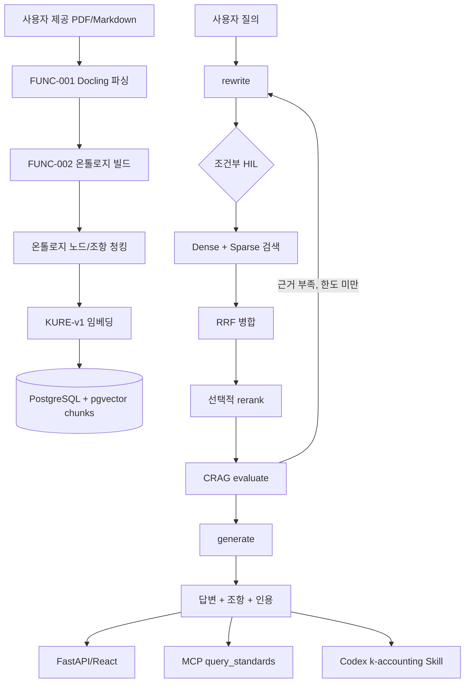

# 회계 기준서 RAG 서비스 아키텍처

> **한 줄 요약(BLUF):** 현행 서비스는 K-GAAP 중심 회계 기준서 원문을 온톨로지 노드로 구조화해 pgvector에 적재하고, LangGraph 워크플로가 질의 재작성 → 하이브리드 검색 → 선택적 리랭킹 → CRAG 평가 → 인용 답변 생성을 수행한다. 2026-07-11 회의의 문서 업데이트 요구사항(아키텍처·로직·설치·성능 지표)을 기준으로 현행 코드 상태를 정리한다.

## 1. 서비스 목적

회계사와 감사인이 비상장 중소기업 감사 업무에서 K-GAAP 조항을 빠르게 확인하도록 돕는다. 사용자는 자연어로 질문하고, 서비스는 관련 조항을 검색한 뒤 답변과 인용을 함께 반환한다.

서비스의 핵심 품질 기준은 다음 순서다.

1. 정확한 조항 검색
2. 인용 가능한 근거 제시
3. 근거를 벗어나지 않는 답변 생성
4. UI·API·MCP·Codex Skill에서 같은 워크플로 계약 유지

## 2. 현행 구성



## 3. 런타임 경로

| 경로 | 진입점 | 역할 |
|---|---|---|
| CLI 적재 | `uv run python -m src.main ingest` | 온톨로지 JSON 또는 단일 PDF/Markdown을 청킹·임베딩해 `chunks` 테이블에 저장한다. |
| CLI 질의 | `uv run python -m src.main query "..."` | 동일 LangGraph 워크플로를 터미널에서 실행한다. |
| HTTP API | `src/api/server.py` | `/query`, `/resume`, `/documents/{document_id}/pdf`, `/health`를 제공한다. |
| React UI | `frontend/` | FastAPI 앱 컨테이너가 빌드 산출물을 `:8000`에서 함께 서빙한다. |
| MCP | `src/mcp_server/server.py` | `query_standards`, `resume_query` 도구로 동일 워크플로를 노출한다. |
| Codex Skill | `src/skills/k-accounting/SKILL.md` | 회계 기준 질의를 감지해 MCP 도구 호출을 유도한다. |

API 응답 스키마의 정본은 `src/api/schemas.py`다. 내부 `GraphState` 전체를 노출하지 않고, 완료 응답은 `answer`, `clauses`, `citations`, `error_code` 중심으로 축약한다.

## 4. 적재 파이프라인

적재는 `src/main.py`의 `ingest` 서브커맨드에서 시작한다.

1. `--pdf` 입력이면 `DoclingParser`가 PDF를 Markdown으로 변환한다.
2. `build_graph(md_path, standard_id, standard_type)`가 Markdown을 Standard/Section/Subsection 노드와 관계로 구조화한다.
3. `chunk_graph()`가 content를 가진 노드를 검색 청크로 변환한다.
4. `index_documents()`가 KURE-v1 임베딩을 생성해 PostgreSQL `chunks` 테이블에 upsert한다.

청킹 기본값은 온톨로지 노드 단위다. `--clause-level`을 켜면 `#### N.N` 형식의 H4 조항 헤더를 먼저 경계로 삼고, 이후 `CHUNK_MAX_TOKENS=2048` 상한을 적용한다. 토큰 초과 시 문단 → 문장 → 문자 순으로 더 작은 경계를 사용한다.

`chunk_id`는 결정적 ID다. 분할되지 않은 청크는 노드 ID를 그대로 쓰고, 분할된 청크는 `node-id-0`, `node-id-1`처럼 순번을 붙인다. 이 규칙 때문에 재적재가 `ON CONFLICT(chunk_id) DO UPDATE`로 멱등하게 동작한다.

## 5. 검색 파이프라인

검색은 `src/retrieval/searcher.py`가 담당한다.

| 단계 | 현행 구현 |
|---|---|
| Dense | KURE-v1 질의 임베딩과 pgvector cosine distance를 사용한다. |
| Sparse | PostgreSQL `to_tsvector('simple', content)` + `plainto_tsquery('simple', query)` + `ts_rank_cd`를 사용한다. |
| 병합 | Dense/Sparse 결과를 RRF(`RRF_K=60`)로 병합한다. |
| 장애 처리 | 한쪽 검색이 실패하면 다른 쪽 단독 결과로 진행한다. 양쪽 모두 실패하면 DB 오류로 처리한다. |
| 재탐색 | 결과가 0건이면 `top_k * 2`로 한 번 더 검색한다. |

2026-07-11 회의에서 언급된 형태소 분석기 기반 sparse 검색과 동의어 사전은 현행 구현이 아니다. 현재 sparse는 PostgreSQL `simple` 설정이라 한국어 형태소 분석이나 IDF 기반 BM25를 제공하지 않는다. 이 차이는 검색 개선 이슈를 만들 때 반드시 구분한다.

## 6. 워크플로 제어

LangGraph 워크플로는 `src/agent/workflow.py`가 구성한다.

```text
rewrite
  ├─ 비회계 질의: early_exit
  └─ 회계 질의: human_review → search → rerank → evaluate → generate
```

주요 규칙은 다음과 같다.

| 규칙 | 값/동작 |
|---|---|
| 재작성 전략 | `hyde`, `decompose`, `stepback` |
| HIL 조건 | 전략이 `decompose` 또는 `stepback`이고 아직 승인되지 않은 경우 |
| HIL 한도 | `MAX_HIL_COUNT=5` |
| CRAG 재작성 한도 | `MAX_REWRITE_COUNT=3` |
| 노드 타임아웃 | `step_timeout=30`초 |
| 리랭커 | `USE_RERANKER=false` 기본값. 켜면 `BAAI/bge-reranker-v2-m3`를 사용한다. |

`evaluate`가 근거 부족을 판단하거나 rerank 임계값 미달로 `needs_reretrieval=True`가 세워지면 rewrite로 되돌아간다. 한도를 넘으면 현재 근거로 답변 생성 단계에 진입하거나 폴백 응답을 반환한다.

## 7. 데이터베이스와 모델

| 항목 | 값 |
|---|---|
| DB | PostgreSQL + pgvector |
| 운영 테이블 | `chunks` |
| PK | `chunk_id TEXT PRIMARY KEY` |
| 메타데이터 | `metadata JSONB` |
| 벡터 | `embedding vector(1024)` |
| 벡터 인덱스 | HNSW `vector_cosine_ops` |
| 임베딩 모델 | `nlpai-lab/KURE-v1` |
| 임베딩 서빙 | Docker TEI 컨테이너(`embedding`) 또는 프로세스 내 로드 |
| LLM 모델 | `OPENAI_MODEL` 설정값 |

원문 PDF는 저장소에 포함하지 않는다. 원문은 배포 주체인 한국회계기준원에서 각자 받는 것을 원칙으로 하고, 파싱·청킹 결과처럼 팀이 가공한 데이터는 팀 작업물 보호 방침에 따라 공개하지 않는다. `PDF_DIR` 기본값은 `data/raw_data`이며, API의 PDF 서빙은 `resolve_pdf_path(document_id, PDF_DIR)` 규칙을 따른다.

## 8. 배포/개발 형태

Docker Compose는 세 서비스를 띄운다.

| 서비스 | 역할 | 포트 |
|---|---|---|
| `database` | pgvector PostgreSQL | `5432` |
| `embedding` | KURE-v1 TEI 임베딩 서버 | `8080` |
| `app` | FastAPI API + React 정적 파일 | `8000` |

기본 사용자 진입점은 `http://localhost:8000`이다. API 문서는 `http://localhost:8000/docs`에서 확인한다.

HIL 체크포인터는 현재 프로세스 로컬 `MemorySaver`다. 따라서 FastAPI는 단일 워커 전제이며, 서버 재시작 시 진행 중인 HIL 세션은 사라진다.

## 9. 평가와 성능 지표

2026-07-11 회의에서 “실제 성능 지표” 문서화가 요구됐지만, 신뢰 가능한 수치는 테스트 데이터셋 검수 이후에만 확정한다. 현행 문서화 범위는 다음으로 제한한다.

| 축 | 현행 상태 | 정본 문서/코드 |
|---|---|---|
| 검색 통과 | 핵심 조항 Top-5 기준 구현 | `docs/benchmark/eval_pass_rules.md`, `tests/utils/benchmark_metrics.py` |
| 내용 통과 | 별도 judge 미구현 | 같은 문서의 `content_pass` 섹션 |
| 속도 | API/검색/답변 속도 정식 리포트 미작성 | 향후 측정 산출물은 `docs/measurements/`에 둔다. |
| 리랭커 실험 | 2026-07-05 측정 문서가 있었으나 현재 문서 트리에는 포함되어 있지 않다 | 측정 산출물은 `docs/measurements/`에 둔다. |

검증되지 않은 숫자를 README나 아키텍처 문서에 박제하지 않는다. 벤치마크 데이터셋이 교정되면 측정 명령, 환경, 데이터셋 버전, 결과 해석을 함께 남긴다.

## 10. 2026-07-11 회의 반영 상태

| 회의 항목 | 문서 반영 |
|---|---|
| 아키텍처 업데이트 | 이 문서가 현행 SSoT다. |
| 로직 정리 | 검색, 청킹, HIL/CRAG, API 계약을 코드 기준으로 정리했다. |
| 설치 가이드 | `docs/guides/local_dev_setup.md`, `docs/guides/docker_setup_guide.md`가 담당한다. |
| README 업데이트 | 루트 `README.md`와 `docs/README.md`에서 현행 경로를 연결한다. |
| 성능 지표 | 검수된 데이터셋 기반 수치만 별도 measurements 문서로 남긴다. |
| 온톨로지 규칙 | `docs/guides/ontology_guide.md`가 담당한다. |
| 하이브리드/BM25 | `docs/guides/retrieval_guide.md`가 현행 sparse 구현과 한계를 분리해 설명한다. |

## 변경 이력

| 날짜 | 내용 |
|---|---|
| 2026-03-21 | Apache AGE/EdgeQuake/GraphRAG 전제 초기 설계 작성 |
| 2026-07-17 | 2026-07-11 회의록과 현행 코드 기준으로 pgvector + BM25-style sparse + LangGraph 아키텍처 문서로 재작성 |
