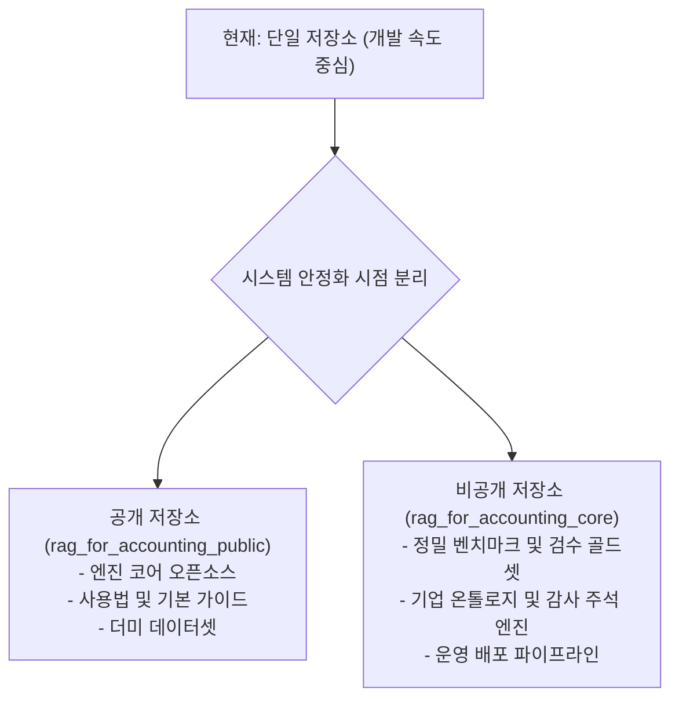

# 문서·데이터 공개 정책 및 저장소 분리 가이드

본 문서는 회계 기준서 RAG 시스템이 안정화 단계에 도달한 후 공개 저장소(Public Repository)와 비공개 저장소(Private Repository)로 분리 운영되기 전까지, 단일 저장소 내에서 팀의 핵심 노하우와 공개 가능한 기술 자산을 안전하게 구분하여 관리하기 위한 기준을 명문화합니다.

---

## 1. 도입 배경: 왜 지금 공개 정책이 필요한가

현재 본 프로젝트는 개발 속도와 협업 효율을 위해 단일 공개 저장소 체제로 운영되고 있습니다. 하지만 회계 기준서 RAG 시스템의 경쟁력은 단순한 파이프라인 코드뿐 아니라, 다음과 같은 핵심 자산에 크게 의존합니다.

1. 수개월에 걸쳐 회계사와 감사인의 검수를 거쳐 구축한 정밀 벤치마크 정답셋 및 질의셋(`benchmark.jsonl`)
2. 기준서 조항 간의 실무적 인용 관계와 골드 라벨 데이터
3. 실제 비즈니스 환경과 고객사 데이터에 적용하기 위한 실증 평가 기준

이러한 핵심 자산은 무단으로 외부에 노출될 경우 팀의 지적 재산권과 경쟁 우위가 훼손될 위험이 있습니다. 또한 한국회계기준원(KASB) 기준서 원문처럼 외부 배포 주체의 이용 허락 규약을 준수해야 하는 제약도 공존합니다.

따라서 시스템 안정화 이후 예정된 **공개 오픈소스 저장소**와 **사내 비공개 저장소**로의 분리 작업을 사전에 대비하고, 현재 단계에서부터 팀원과 AI 에이전트가 데이터와 문서를 다룰 때 혼선을 겪지 않도록 명확한 3단계 분류 기준을 정의합니다.

---

## 2. 데이터 및 문서 3단계 분류 체계

저장소 내 모든 파일, 문서, 데이터셋은 다음 3가지 범주 중 하나로 엄격히 분류하여 관리합니다.

| 구분 | 관리 위치 | 대상 항목 예시 | 취급 및 공유 원칙 |
|---|---|---|---|
| **기밀 자산 (Proprietary)** | `.gitignore` 적용 및 사내 보안 클라우드 (Google Drive / Sheets) | • 검수 완료된 벤치마크 정답셋 (`data/test_data/benchmark.jsonl`)<br>• 회계사 검수 골드 라벨 원천 데이터<br>• 고객사 실데이터 및 재무제표 샘플<br>• 비공개 프롬프트 및 평가 하이퍼파라미터 | 저장소 커밋을 엄격히 금지합니다. 로컬 작업 공간에서만 임시 활용하며, 팀 내 공유는 승인된 사내 드라이브를 통해서만 수행합니다. |
| **내부 전용 (Internal Context)** | 향후 비공개 레포 이관 대상 (현재는 주석 또는 내부 트랙 관리) | • 기업 관계 온톨로지 상세 설계안 (`docs/ontology/rationale.md`)<br>• 감사보고서 주석 생성 연계 기획<br>• 내부 의사결정 회의록 및 사업화 로드맵<br>• 비공개 API 키 및 운영 배포 인프라 구성 | AI 에이전트와 내부 개발자가 개발 맥락 파악을 위해 참고할 수 있으나, 외부에 오픈소스로 배포하지 않습니다. |
| **공개 가능 (Public Domain)** | 공개 저장소 (`docs/`, `README.md`, 공개 Issues) | • 시스템 전체 아키텍처 다이어그램 및 설계 개요<br>• 5단계 파이프라인(rewrite/search/rerank/evaluate/generate) 코드<br>• Docker/uv 개발 환경 셋업 가이드 및 CLI 실행법<br>• 가짜 데이터 기반 단위/시스템 테스트 코드<br>• MIT 라이선스 및 오픈소스 기여 가이드 | 누구나 자유롭게 열람하고 실행할 수 있는 오픈소스 기술 자산으로 유지합니다. |

---

## 3. 기밀 자산의 안전한 격리 및 `.gitignore` 운영 방안

### ① 벤치마크 데이터셋 격리 원칙
현재 저장소의 `data/test_data/benchmark.jsonl` 파일은 시스템 성능 검증을 위한 필수 데이터이지만, 동시에 팀의 핵심 노하우가 집약된 자산입니다.
- 단기 조치: 개발 편의상 현재 저장소에 임시 유지하되, 평가 지표 고도화 및 운영 전환 시점 이전에 `.gitignore` 대상으로 전환합니다.
- 중장기 조치: 공개 저장소에는 구조만 검증할 수 있는 소규모 가짜 벤치마크 샘플(1~2건의 모의 질의)만 남기고, 실제 정답셋은 Google Drive 기반 보안 스토리지로 이관합니다.

### ② 원문 PDF 및 가공 데이터 격리 (BYO 원칙 준수)
- 한국회계기준원의 일반기업회계기준 원본 PDF는 저장소에 절대 커밋하지 않으며, `data/raw_data/*.pdf` 규칙으로 git 추적에서 제외합니다.
- 파싱 및 청킹 결과물 또한 팀의 1차 가공 자산이므로 비공개 원칙을 유지하며 각 개발자가 로컬 파이프라인을 통해 직접 생성하도록 안내합니다.

---

## 4. 안정화 이후 저장소 분리 절차

시스템 안정화가 완료되면 단일 저장소를 다음과 같이 2개의 저장소로 분리하여 운영합니다.



### 과거 Git 커밋 이력 정제 (History Scrubbing) 가이드라인
공개 저장소를 분리하거나 기존 저장소를 완전 공개로 전환하기 전, 과거 커밋 히스토리에 포함된 민감 데이터와 벤치마크 정답셋을 깨끗이 제거해야 합니다.

1. **대상 식별**: `data/test_data/benchmark.jsonl`, 과거 백업 덤프(`.dump`, `.sql`), 비공개 설정 파일의 과거 커밋 해시 추적.
2. **도구 활용**: 단순 삭제 커밋(`git rm`)은 과거 이력에 데이터가 그대로 남으므로, `git-filter-repo` 도구를 사용하여 전체 브랜치와 태그에서 대상 파일의 흔적을 영구 제거합니다:
   ```bash
   # git-filter-repo를 활용한 특정 경로 영구 배제 예시
   git filter-repo --path data/test_data/benchmark.jsonl --invert-paths
   ```
3. **무결성 점검**: 히스토리 정제 완료 후 공개 저장소의 원격 푸시를 진행하며, 비공개 저장소는 기존 전체 히스토리를 보존하여 독립된 원격 저장소로 이관합니다.

---

## 5. `docs/` 디렉터리 문서 존치 및 작성 원칙

공개 저장소의 `docs/` 디렉터리에 문서를 추가하거나 수정할 때는 다음 체크리스트를 준수합니다.

- [ ] 문서에 외부에 공개되어서는 안 되는 고객사명, 실제 계약 조건, 비공개 재무 수치가 포함되어 있지 않은가?
- [ ] 벤치마크 성능을 기술할 때 원천 질문과 정답 텍스트 전체를 복제하지 않고 지표 수치(Hit@K, MRR 등) 중심으로 요약하였는가?
- [ ] 형식적인 요약 문구에 치중하지 않고, 개발자와 기여자가 시스템의 동작 원리를 쉽게 이해할 수 있도록 명확하고 완성된 문장으로 서술하였는가?
