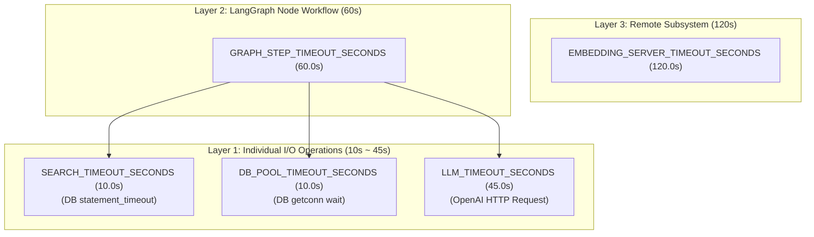

# 예외 처리 및 런타임 타임아웃 정책

본 문서는 Accounting RAG 시스템의 **예외 분류 체계**, **타임아웃 계층 구조**, **일시 장애 재시도** 및 **상태 폴백 처리 규약**을 명문화합니다.

---

## 1. 예외 분류 체계

모든 커스텀 예외는 `AccountingRAGError`([src/utils/exception.py])를 상속하며, 발생한 노드와 카테고리별 에러 코드를 보유하여 `ErrorLog` 스키마로 구조화됩니다.

| 카테고리 | 에러 코드 | 예외 클래스 | 설명 |
|---|---|---|---|
| **Common (CM)** | `CM-001` | `ConfigNotFoundError` | 필수 환경변수 또는 설정 파일 누락 |
| | `CM-002` | `LLMAPIConnectionError` | OpenAI/임베딩 API 연결 실패, 타임아웃, 인코딩 실패 |
| | `CM-003` | `DocumentParseError` | 문서 파일 파싱 실패 |
| **Search (SE)** | `SE-101` | `SearchTimeoutError` | pgvector 쿼리 실행 시간 초과 |
| | `SE-102` | `DatabaseQueryError` | DB 커넥션 풀 고갈/연결 실패 또는 쿼리 실행 오류 |
| | `SE-103` | `NoContextFoundError` | 검색 결과 부재 또는 검색 임계치 미달 |
| **Rerank (RR)** | `RR-201` | `RerankFailureError` | 리랭킹 모델 호출/점수 계산 실패 |
| | `RR-202` | `ScoreThresholdError` | 리랭킹 후 임계치 만족 청크 0건 |
| **Index (IX)** | `IX-201` | `EmbeddingTokenLimitError` | 임베딩 생성 시 토큰 한도 초과 (부분 스킵) |
| **Evaluate (EV)**| `EV-301` | `EvaluationParsingError` | LLM 평가 응답 스키마 파싱 실패 |
| | `EV-302` | `InconsistentVerdictError` | 평가 내부 일관성 위반 |
| | `EV-303` | `HallucinationDetectedError` | 검색 결과 미근거 주장의 환각 감지 |
| **Generate (GN)**| `GN-401` | `LLMResponseFormatError` | LLM 답변 포맷/스키마 불일치 |
| | `GN-402` | `ContextLengthExceededError` | 컨텍스트 길이가 모델 최대 토큰 초과 |

---

## 2. 타임아웃 계층 구조

시스템 런타임 안정성과 자원 누수 방지를 위해 **"안쪽(개별 I/O) 타임아웃 < 바깥쪽(노드 step_timeout) 타임아웃"** 원칙을 엄격히 준수합니다.

### 계층별 설정값 및 단일 진실원 (SSoT: `src/utils/config.py`)

1. **Layer 1: Individual I/O**
   - `SEARCH_TIMEOUT_SECONDS` (기본값: 10.0초): PostgreSQL `statement_timeout`으로 전달. 초과 시 `SearchTimeoutError(SE-101)` 발생.
   - `DB_POOL_TIMEOUT_SECONDS` (기본값: 10.0초): 커넥션 풀의 `getconn()` 대기 상한. 초과 시 `DatabaseQueryError(SE-102)` 파생.
   - `LLM_TIMEOUT_SECONDS` (기본값: 45.0초): OpenAI Client HTTP 요청 타임아웃. 초과 시 `LLMAPIConnectionError(CM-002)` 파생.
2. **Layer 2: LangGraph Node Workflow**
   - `GRAPH_STEP_TIMEOUT_SECONDS` (기본값: 60.0초): LangGraph 노드 1개 단위 실행 상한.
3. **Layer 3: External Remote Subsystem**
   - `EMBEDDING_SERVER_TIMEOUT_SECONDS` (기본값: 120.0초): 외부 TEI 임베딩 컨테이너 통신 상한.

> **안전 마진 및 선순위 이점**: LangSmith/운영 실측 데이터 수집 전 긴 회계 답변 생성이 억울하게 취소되지 않도록 45s/60s의 여유 버퍼를 부여합니다. Layer 1의 I/O 타임아웃(45초)이 Layer 2 노드 타임아웃(60초)보다 먼저 발생하므로, OpenAI API 요청이 멈춘 상태로 10분간 지속되면서 토큰 비용과 커넥션을 소모하는 고아 요청 현상을 차단합니다.

---

## 3. 재시도 및 에러 복구 정책

인프라 일시 장애와 질의 품질 부족에 따른 CRAG 쿼리 재작성 루프를 개념적으로 분리하여 관리합니다.

1. **국소 SDK 재시도**
   - `LLM_MAX_RETRIES` (기본값: 1회): OpenAI SDK 차원의 재시도를 1회로 제한합니다.
   - 순간적인 네트워크 지연은 SDK 레벨에서 1회 신속 재시도 후 흡수하며, 지속 실패 시 빠르게 `LLMAPIConnectionError`를 던집니다.
2. **CRAG 쿼리 재작성 루프**
   - `MAX_REWRITE_COUNT` (기본값: 3회): 검색 결과의 신뢰도/근거성이 부족할 때 쿼리를 재작성하여 통과를 시도합니다.
   - SDK `LLM_MAX_RETRIES`를 1회로 제한함으로써, 동일 장애 상황에서 SDK 재시도와 CRAG 루프가 중복으로 동작하여 요청 지연이 증폭되는 현상을 막습니다.

---

## 4. 런타임 예외 처리 및 폴백

1. **노드 단위 예외 흡수**:
   - 각 노드 내부 예외는 `handle_node_errors` 데코레이터에 의해 캐치되어 `state.error_logs`에 기록되고 워크플로우 실행이 지속됩니다.
2. **워크플로우 레벨 완전 타임아웃/재귀 폴백**:
   - 노드 타임아웃이나 최대 재귀 깊이 초과 발생 시, 시스템은 예외를 무작정 터뜨리지 않고 폴백 응답 및 `error_code="TIMEOUT"` 또는 `"RECURSION_LIMIT"`을 전달합니다.
